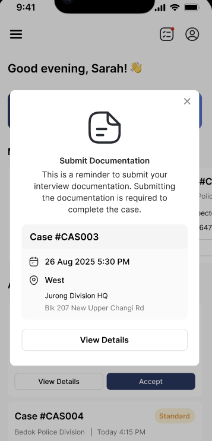

# ✅ Completed Case

This guide covers what to do after completing an interview.

---

## Overview

After successfully attending and completing an interview, you need to submit documentation through the CAS Mobile App.

---

## After Interview Completion

### Step 1: Open My Assignments

- Open the CAS Mobile App
- Tap the menu icon (☰) on the left
- Select **My Assignments**

### Step 2: Select the Completed Case

Find and tap on the case you just completed.

### Step 3: Submit Documentation

- **Fill in Times:** Enter the required times
   - **Arrival Time** ≤ **Interview Start Time** ≤ **Interview End Time**
- **Take Photo:** Tap **Take Photo** to capture documentation
   - The app will automatically crop and scan the document
   - You can also tap **Upload Photo** to select from gallery
- **Review:** Check the photo quality is clear and legible
- **Add Notes:** Include any relevant notes about the interview
- **Submit:** Tap **Submit** to complete
- **Feedback:** Give feedback answer by a 5-star rating about your experience

**Follow along this short video to see how to submit documentation**

<iframe width="560" height="315" src="https://www.youtube.com/embed/5YbgksbCYGo" frameborder="0" allow="accelerometer; autoplay; clipboard-write; encrypted-media; gyroscope; picture-in-picture" allowfullscreen></iframe>

---

## Documentation Reminders

If you forget to submit documentation:

- ⏰ Reminders are sent **every 4 hours** after the interview
- Reminders continue until documentation is submitted
- Tap the reminder notification to go directly to the case

{: style="max-width:400px" }

---

## View Completed Cases

To view your past completed cases:

1. Open the left-hand side menu
2. Tap **My History**
3. Browse your completed cases

### What You Can See

| Information | Available |
|------------|-----------|
| Case ID | ✅ Yes |
| Date | ✅ Yes |
| Location | ✅ Yes |
| Status | ✅ Yes |
| Youth Details and IO information | 🔒 Masked |

🔒 **Note:** Youth details are masked in historical cases for privacy protection.

---

## Tips for Smooth Completion

- **Submit promptly:** Complete documentation as soon as possible after the interview
- **Good photos:** Ensure photos are clear and all text is readable
- **Detailed notes:** Include relevant information in your notes
- **Check status:** Verify your submission was successful in My History

