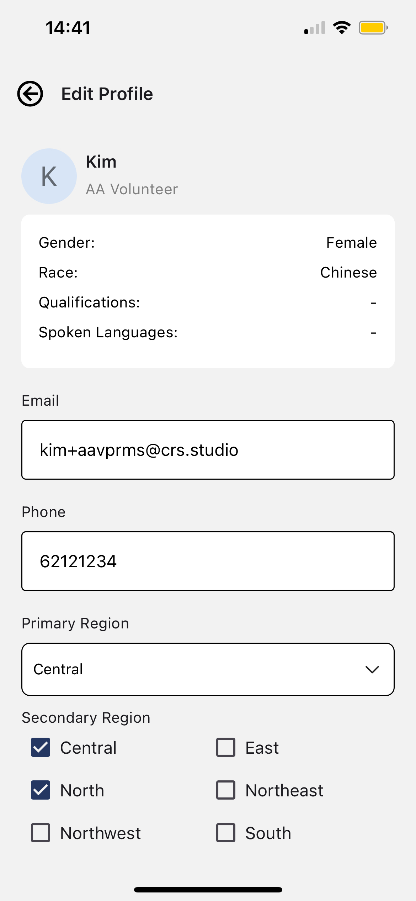

# Profile Management (AA Mobile App)

This guide explains what AAs can manage in their profile on the CAS Mobile App.

## Overview

AA profile data is primarily managed in **Salesforce VPRMS** and synced to CAS.

In the mobile app, AAs can typically edit:

- **Phone number**: 8 digits starting with 6/8/9
- **Notification preferences**: **Scheduled Availability** is checked against the **current time** when a case is created/broadcast. If it’s outside your configured time range for that day, you will be **excluded from broadcasting** (you won’t receive the case broadcast push).
- **Regional preferences**: primary/secondary regions
- **Timing preferences**: checked against the **interview date/time** (interview time slot). Set this correctly to be included in the eligible AA pool.

All other fields are **view-only** in the app, including:

- **Email**
- **Name**
- **AA ID**
- **Qualifications**
- **Language**
- **Race**

---

## View and Edit AA Profile

### Step 1: Open Profile

Open the app and go to **Profile**.

  
  →
  

### Step 2: Review Your Details

You can view your profile information (including view-only fields like **Name**, **Email**, **AA ID**, **Qualifications**, **Language**, **Race**).

{: style="max-width:400px" }

### Step 3: Update Editable Fields

You can typically edit: Phone number, regional preferences, timing preferences

- **Phone number** (8 digits starting with 6/8/9)
- **Regional preferences** (primary/secondary regions)
- **Timing preferences**

### Step 4: Save Changes

Tap **Save Details** to apply changes. Updates will sync back to VPRMS.

---

## Edit Notification Preferences

### Step 1: Go to Notification Preferences

Open the app and go to **Profile** → **Notification Preferences**.

  
  →
  

### Step 2: Update Preferences

Update your notification settings:

- **Scheduled Availability**: set your available **time range by day** (From/To + day of week). The system checks the **current time when the case is created/broadcast**. If it’s outside your configured time range for that day, you will be **excluded from broadcasting**.
- **Date Range Mute**: toggle enable to set leave period (From Date/To Date). During this period, you will be **excluded from broadcasting**.

**Example:**

- You set **Monday** availability: **8:00 AM – 10:00 AM**
- A case is created/broadcast on **Monday, 11:00 AM**
- ✅ Result: You will be **excluded from broadcasting** for that case due to your scheduled availability setup

  
  

**Note:** Interview reminders are **always sent** regardless of pause settings.

### Step 3: Save Changes

Tap **Save Preferences** to apply changes.

---

## 🎥 Video Tutorial

Watch the video tutorial below for a step-by-step guide on managing your profile:

  <iframe 
    width="100%" 
    height="700" 
    src="https://www.youtube.com/embed/zH5fL9gnsVA" 
    title="Profile Management Tutorial" 
    frameborder="0" 
    allow="accelerometer; autoplay; clipboard-write; encrypted-media; gyroscope; picture-in-picture" 
    allowfullscreen>
  </iframe>

