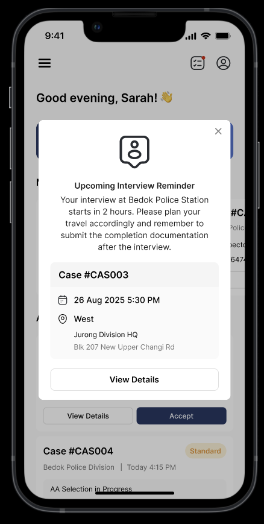
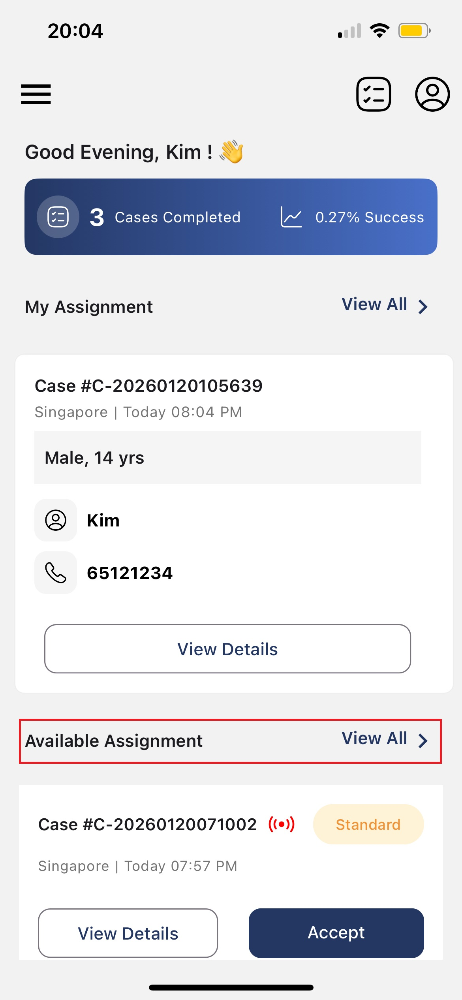

# 📱 Using the App

A quick summary of the CAS Mobile App features.

## Before You Start

Before using the CAS Mobile App, you need to complete these steps:

1. **Create account on VPRMS** – Your AA profile must be created in Salesforce VPRMS by Care Corner staff
2. **Receive setup email** – You will receive an email to set up your password
3. **Wait for sync** – Your account will be automatically synced from VPRMS to CAS
4. **Login to CAS Mobile App** – Use your registered email to login

📌 **Note:** If you cannot login, contact Care Corner to verify your VPRMS account status.

---

## Overview

The CAS Mobile App allows Appropriate Adults to receive case notifications, respond to assignments, and submit documentation after interviews.

---

## Quick Links

| Scenario | Guide |
|----------|-------|
| ✅ [Accept and Confirm Case](accept-and-confirm-case.md) | Full flow from notification to confirmation |
| ❌ [Case Cancellation](case-cancellation.md) | All cancellation scenarios including onsite cancellation |
| ✅ [Completed Case](completed-case.md) | After completing an interview |

---

## Notification Types

### 📢 New Case Broadcast

**When:** When a new case is created and you are eligible based on matching criteria.

**What it shows:**

- Case details
- Broadcast type indicator (B1 (none)/B2🟡/B3🔴)

**Action required:** Accept if available, or close to decline.

---

### ✅ Assignment Confirmation

**When:** After you accept a case and are selected by the system.

**What it shows:**

- Complete case details
- Youth information
- IO contact details
- Full location with map

**Action required:** Confirm within **5 minutes** or the case is re-broadcast.

⚠️ Declining or timeout without response results in Low Priority flag for 14 days.

---

### ❌ Case Cancellation

**When:** IO or Call Centre cancels your assigned case.

**What it shows:**

- Case ID
- Cancellation details
- Option to submit documentation

**Action required:** Acknowledge within **30 minutes**. Submit documentation if you've incurred travel expenses.

---

### ⏰ Interview Reminder

**When:** **2 hours before** your scheduled interview.

**What it shows:**

- Interview time and location
- Case details

**Action required:** Prepare for the interview.

📌 **Note:** Interview reminders are **always sent** even if you have "Pause Notifications" enabled.

{: style="max-width:400px" }

---

### 📄 Documentation Reminder

**When:** After interview is completed, if documentation not yet submitted.

**What it shows:**

- Case ID
- Reminder to submit documentation

**Frequency:** Sent **every 4 hours** 

**Duration:** Up to 24 hours (maximum 5 reminders)

**Escalation:** After 24 hours, AAYS Manager notified

**Action required:** Go to My Assignments and submit documentation.

{: style="max-width:400px" }

---

### 🏆 Badge Achievement

**When:** You earn a badge for your contributions.

**What it shows:**

- Badge name and details
- Congratulations message

---

## When Will You Receive Case Broadcast?

When a case is created, the system checks if you qualify based on **8 criteria**. You must pass all stages to receive the notification:

1. **Qualifications** – Match case requirements (e.g., House Visit, YS Under 10)
2. **Region** – Your preferred region matches case location
3. **Timing** – Your timing preference matches interview time slot
4. **Gender** – Matches case requirement (if specified)
5. **Language** – You speak required language (if specified)
6. **Race** – Matches case requirement (if specified)
7. **Cooldown** – No active case or case within 3 hours
8. **Quiet Hours** – Not in pause/quiet hours mode

---

## Broadcast Types (B1, B2, B3)

| Indicator | Broadcast Type | Meaning |
|-----------|---------------|---------|
| No dot | B1 (Standard) | Primary region, weighted selection |
| 🟡 Yellow | B2 (Secondary) | Primary + Secondary region, FCFS |
| 🔴 Red | B3 (Staff-only) | Urgent, all regions, FCFS |

### B1: Standard Broadcast (No indicator)

This is the first broadcast for a new case. Only AAs with **primary region** matching the case location will receive this notification.

**How it works:**

- **Holding Period (5 mins):** System collects all responses, then uses weighted selection
- **Waiting Period (10 mins):** FCFS (first to accept wins)

### 🟡 B2: Secondary Region Broadcast (Yellow dot)

Sent when B1 fails (no one responded/confirmed) or for non-urgent case re-broadcasts. AAs with **primary OR secondary region** matching case location will receive this.

**How it works:**

- No holding period – FCFS immediately
- First to accept is moved to confirmation

### 🔴 B3: Staff-Only Broadcast (Red dot)

Sent for urgent cases (interview ≤ 4 hours away) after B2 fails, or for last minute cases. Only **AA Staff** receive this notification, ignoring all region/timing preferences.

**How it works:**

- No holding period – FCFS immediately
- AAYS Manager also notified via email/SMS

---

## View Available Assignments (Broadcasting)

When a case is broadcasting, open the app to view the available assignment and check case details (Case ID, interview time/location, and requirements).

{: style="max-width:400px" }

## View My Assignments

1. Open the left-hand side menu (☰)
2. Tap **My Assignments** to view your current assignments

  
  →
  

## View My History

1. Open the left-hand side menu (☰)
2. Tap **My History** to view your past cases

  
  →
  

---

## Low Priority Flag

### What is it?

A Low Priority flag may be applied when:

- You **decline at the confirmation stage** (after being selected) or **timeout without response at the confirmation stage**
- You **self-cancel an assignment**

### Duration

**14 days** from the decline action.

### Impact

- Lower chance of being selected during B1 weighted selection
- Does not affect B2/B3 broadcasts (FCFS)
- Does not prevent you from receiving broadcasts

### How to Avoid

- Only accept cases you can truly attend
- Check your calendar before accepting
- Consider travel time and location
- Confirm promptly when selected

---

## Troubleshooting

### Not receiving notifications?

- **Phone notifications:** Settings → Apps → CAS App → Enable notifications
- **App permissions:** Allow notifications in app permissions
- **Do Not Disturb:** Ensure phone is not in DND mode

### Not receiving case broadcasts?

- **Quiet Hours / Scheduled Availability:** Are you outside your configured time range for today?
- **Date Pause:** Are you within your muted date range?
- **Cooldown:** Do you have an active case or recent case within 3 hours?
- **Profile settings:** Are your region and timing preferences correct?
